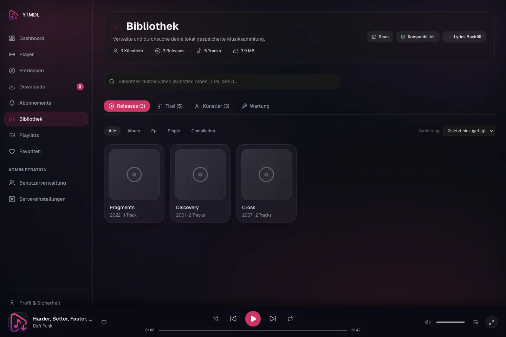
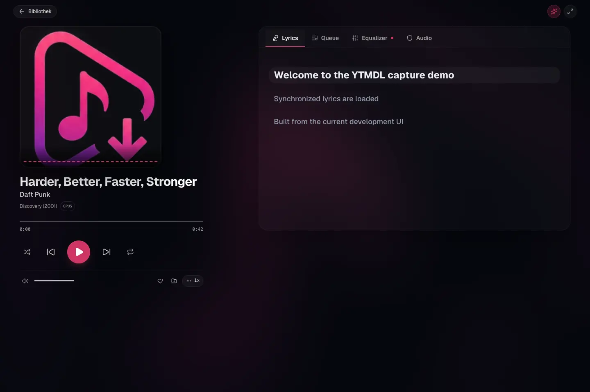
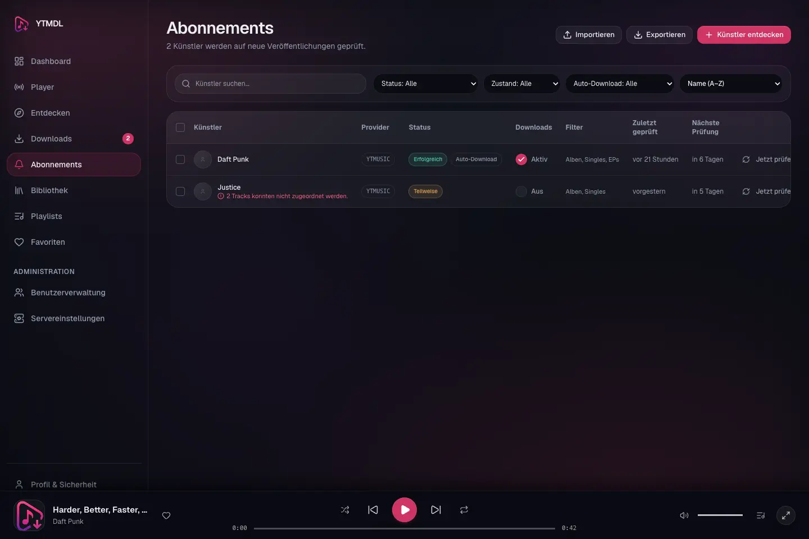
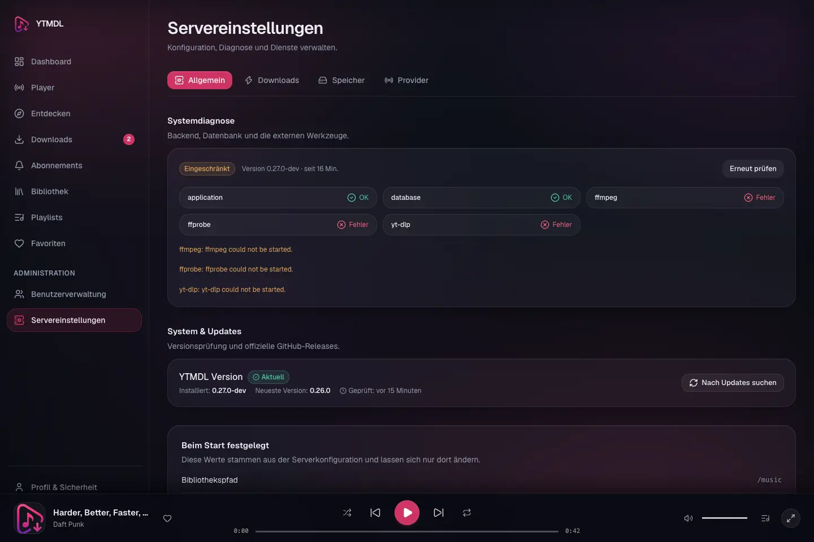

# YTMDL

> **Self-hosted music downloader, library manager, and web player.**

YTMDL lets you build, automate, and stream a personal music library from a modern web interface. It combines artist discography discovery, automated subscriptions, metadata enrichment, synchronized lyrics, and an integrated audio player with parametric EQ and audio DSP.

[](https://github.com/Der-Felix/ytmdl/releases)
[](LICENSE)
[](https://der-felix.github.io/ytmdl/)
[](https://github.com/Der-Felix/ytmdl/pkgs/container/ytmdl-backend)



---

## What is YTMDL?

YTMDL is an independent, self-hosted web application designed to help you build and manage a clean local music collection. It resolves complete artist discographies through structured metadata providers, matches tracks against online audio streams, downloads native Opus audio without unnecessary lossy transcoding, and organizes files into a standardized directory layout compatible with Jellyfin, Plex, Navidrome, and Emby.

---

## Features

- **Artist & Discography Discovery:** Browse full artist catalogs categorized into albums, EPs, and singles with release years and tracklists.
- **Automated Subscriptions:** Subscribe to favorite artists to automatically check for new releases and queue downloads with fair, starvation-protected scheduling.
- **High-Fidelity Audio:** Prefers native Opus streams when available, remuxing directly into clean Ogg/Opus containers to avoid lossy re-encoding.
- **Integrated Web Player:** Modern in-browser audio engine with persistent mini-player, full-screen Now Playing view, playlist queue, 10-band graphic EQ, parametric filters, crossfade, and audio visualizer.
- **Multi-Tier Lyrics:** Automatic lyrics retrieval through LRCLIB (synchronized `.lrc` and plain text `.txt`), YouTube Music, and an optional Genius fallback.
- **Media Server Ready:** Strict, configurable library structure (`Artist/YYYY - Album/NN - Title.opus`), embedded Vorbis comments, cover art, and external `.lrc` sidecars.
- **Library Auditing & Repair:** Non-destructive Quick and Deep audit engine to identify missing tags, invalid bitrates, or orphaned files, with safe quarantine isolation (`.ytmdl-trash`).
- **Update Detection:** Built-in update checker in System & Updates informing administrators of new official GitHub releases with zero telemetry.
- **Multi-User Security:** Role-based access control (Admin / User), Argon2id password hashing, server-side session management, and CSRF protection.
- **Reliable Storage:** Two-phase atomic staging (`/data/staging` → `/music`) with Storage Identity Guard for local disks and host-mounted SMB/CIFS shares.

---

## Quick Start

The recommended way to deploy YTMDL is using official prebuilt container images from the GitHub Container Registry. No local compilation or build dependencies are required.

### 1. Download Compose Configuration

```sh
# Create project folder
mkdir -p ytmdl && cd ytmdl

# Download compose file and sample environment
curl -fsSL -O https://raw.githubusercontent.com/Der-Felix/ytmdl/v0.17.1/compose.ghcr.yaml
curl -fsSL -O https://raw.githubusercontent.com/Der-Felix/ytmdl/v0.17.1/.env.example
cp .env.example .env
```

### 2. Configure Environment

Edit `.env` to set your music storage path and database password:

```env
# Pin a stable release (recommended) or use 'latest'
YTMDL_VERSION=0.17.1

# Path to your local music directory or host-mounted SMB/CIFS share
YTMDL_MUSIC_PATH=/path/to/your/music

# Database credentials
POSTGRES_PASSWORD=replace_with_a_secure_password
MUSICDL_DATABASE_URL=postgres://ytmdl:replace_with_a_secure_password@db:5432/ytmdl?sslmode=disable
```

### 3. Start the Stack

Start the containers using Docker Compose or Podman Compose:

```sh
# Using Docker Compose:
docker compose -f compose.ghcr.yaml up -d

# Or using Podman Compose:
podman compose -f compose.ghcr.yaml up -d
```

### 4. Access the Web Interface

Open your browser and navigate to:

```text
http://localhost:8080
```

1. **First-Run Setup:** The setup wizard will prompt you to create the initial administrator account.
2. **Library Configuration:** Verify that your music folder is mapped to `/music` and accessible.

---

## Interface Showcase

### Web Player & Synchronized Lyrics

Full-screen Now Playing experience with synchronized lyrics, spectrum visualizer, 10-band graphic equalizer, parametric audio filters, and queue management.



### Automated Artist Subscriptions

Monitor artist discographies, track sync schedules, configure auto-download rules, and import or export subscriptions in portable JSON format.



### System & Updates

Built-in update checker verifying official releases against GitHub Releases with zero telemetry and full privacy opt-out.



---

## Documentation

Full documentation, configuration guides, and architecture references are available on the project documentation site:

📖 **[https://der-felix.github.io/ytmdl/](https://der-felix.github.io/ytmdl/)**

- [Getting Started Guide](https://der-felix.github.io/ytmdl/getting-started)
- [Configuration Reference](https://der-felix.github.io/ytmdl/configuration)
- [Storage & SMB Setup](https://der-felix.github.io/ytmdl/storage/)
- [REST API Reference](https://der-felix.github.io/ytmdl/api)
- [Updates & Versioning](https://der-felix.github.io/ytmdl/updates)

---

## Container Distribution

Official container images (built for `linux/amd64`) are published to the GitHub Container Registry:

- **Backend:** `ghcr.io/der-felix/ytmdl-backend`
- **Frontend:** `ghcr.io/der-felix/ytmdl-frontend`

Images can be pulled anonymously without authentication:

```sh
podman pull ghcr.io/der-felix/ytmdl-backend:0.17.1
podman pull ghcr.io/der-felix/ytmdl-frontend:0.17.1
```

For building from source or running a development environment, see [docs/development.md](docs/development.md).

---

## Updating

Administrators can check for new releases directly from **Settings → System & Updates**.

Starting with **v0.16**, updates can be executed safely and transactionally on the host using the official **`ytmdlctl`** CLI:

```sh
# Perform preflight check (dry run)
ytmdlctl update --dry-run

# Apply update with automatic verified backup and rollback protection
ytmdlctl update
```

For complete documentation on installation, backups, rollback, and troubleshooting, see the [Updates & Maintenance Guide](https://der-felix.github.io/ytmdl/updates).

---

## Legal & Compliance

YTMDL is intended strictly for lawful personal use, such as archiving publicly accessible media or content for which you hold appropriate rights.

- YTMDL itself does not host, distribute, or license any audio or video content.
- Users remain solely responsible for ensuring compliance with applicable copyright laws, local regulations, and terms of service of third-party platforms.
- YTMDL is an independent open-source project and is not affiliated with, endorsed by, or sponsored by YouTube, Google, Spotify, Deezer, Genius, or LRCLIB.

For additional legal guidelines, see [LEGAL.md](LEGAL.md).

---

## Security

Security vulnerabilities should be reported privately via [GitHub Private Vulnerability Reporting](https://github.com/Der-Felix/ytmdl/security/advisories/new) rather than public issue trackers. See [SECURITY.md](SECURITY.md) for details.

---

## Contributing

Contributions are welcome! Please review [CONTRIBUTING.md](CONTRIBUTING.md) before submitting issues or pull requests.

---

## License

This project is licensed under the [Apache License 2.0](LICENSE).
Copyright 2026 Felix Möschen.
