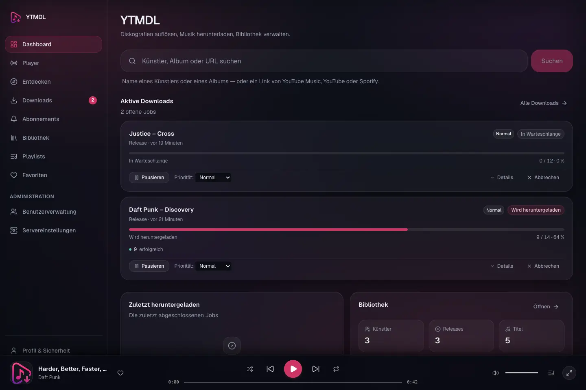
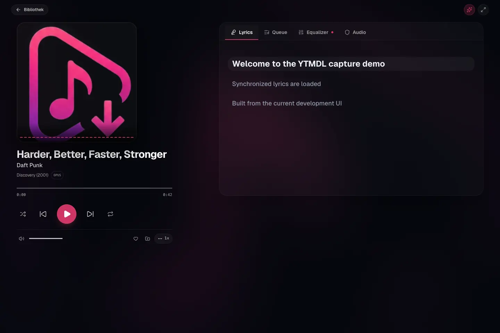
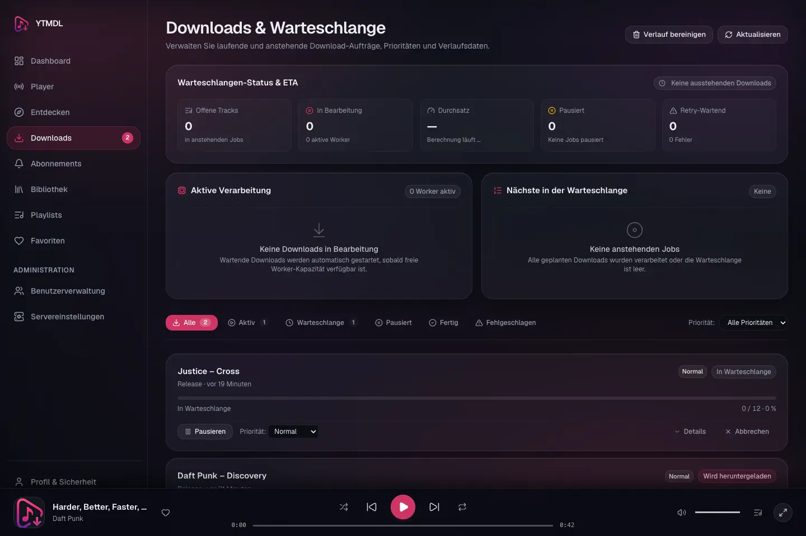
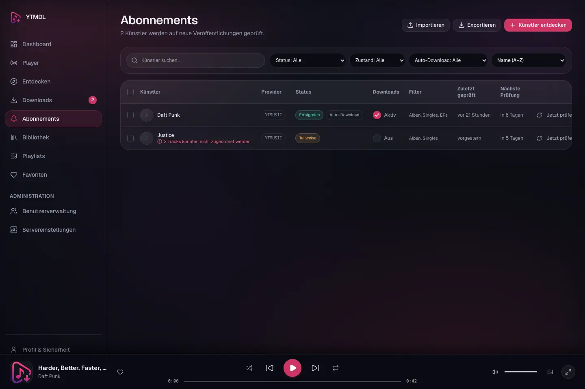
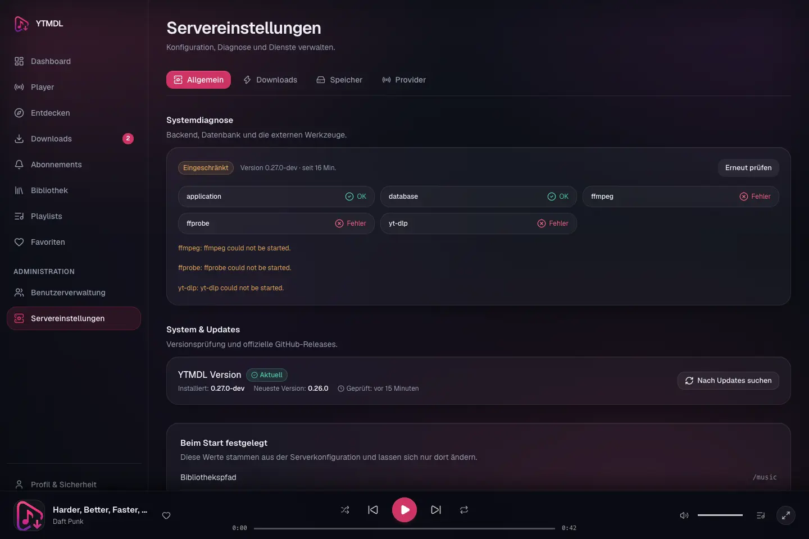

# YTMDL

> **Self-hosted music downloader, library manager, and web player.**

YTMDL lets you build, automate, and stream a personal music library from a modern web interface. It combines artist discography discovery, automated subscriptions, metadata enrichment, synchronized lyrics, and an integrated audio player with parametric EQ and audio DSP.

[](https://github.com/Der-Felix/ytmdl/releases)
[](LICENSE)
[](https://der-felix.github.io/ytmdl/)
[](https://github.com/Der-Felix/ytmdl/pkgs/container/ytmdl-backend)



---

## What is YTMDL?

YTMDL is an independent, self-hosted web application designed to help you build and manage a clean local music collection. It resolves complete artist discographies through structured metadata providers, matches tracks against online audio streams, downloads native Opus audio without unnecessary lossy transcoding, and organizes files into a standardized directory layout compatible with Jellyfin, Plex, Navidrome, and Emby.

---

## Features

- **Artist & Discography Discovery:** Browse full artist catalogs categorized into albums, EPs, and singles with release years and tracklists.
- **Automated Subscriptions:** Subscribe to favorite artists to automatically check for new releases and queue downloads with fair, starvation-protected scheduling.
- **High-Fidelity Audio:** Prefers native Opus streams when available, remuxing directly into clean Ogg/Opus containers to avoid lossy re-encoding.
- **Integrated Web Player:** Modern in-browser audio engine with persistent mini-player, full-screen Now Playing view, playlist queue, 10-band graphic EQ, parametric filters, crossfade, and audio visualizer.
- **Multi-Tier Lyrics:** Automatic lyrics retrieval through LRCLIB (synchronized `.lrc` and plain text `.txt`), YouTube Music, and an optional Genius fallback.
- **Media Server Ready:** Strict, configurable library structure (`Artist/YYYY - Album/NN - Title.opus`), embedded Vorbis comments, cover art, and external `.lrc` sidecars.
- **Library Auditing & Repair:** Non-destructive Quick and Deep audit engine to identify missing tags, invalid bitrates, or orphaned files, with safe quarantine isolation (`.ytmdl-trash`).
- **Update Detection:** Built-in update checker in System & Updates informing administrators of new official GitHub releases with zero telemetry.
- **Multi-User Security:** Role-based access control (Admin / User), Argon2id password hashing, server-side session management, and CSRF protection.
- **Reliable Storage:** Two-phase atomic staging (`/data/staging` → `/music`) with Storage Identity Guard for local disks and host-mounted SMB/CIFS shares.

---

## Quick Start

The recommended way to deploy YTMDL is using official prebuilt container images from the GitHub Container Registry. No local compilation or build dependencies are required.

### 1. Download Compose Configuration

```sh
# Create project folder
mkdir -p ytmdl && cd ytmdl

# Download compose file and sample environment
curl -fsSLO https://github.com/Der-Felix/ytmdl/releases/download/v1.2.0/ytmdl-1.2.0.tar.gz
curl -fsSLO https://github.com/Der-Felix/ytmdl/releases/download/v1.2.0/SHA256SUMS
sha256sum --ignore-missing -c SHA256SUMS
# macOS: shasum -a 256 --ignore-missing -c SHA256SUMS
tar -xzf ytmdl-1.2.0.tar.gz
cd ytmdl-1.2.0
```

### 2. Prepare and Start

```sh
python3 scripts/install.py --engine docker
# Or rootless Podman:
python3 scripts/install.py --engine podman
```

The fresh installer creates a private `.env` with random database credentials,
checks the new data/music directory permissions and enables Storage Identity
Guard. It refuses to overwrite existing installations. See [installation and
upgrade instructions](INSTALL.md) for existing data, NAS mounts and the host CLI.

### 4. Access the Web Interface

Open your browser and navigate to:

```text
http://localhost:8080
```

1. **First-Run Setup:** The setup wizard will prompt you to create the initial administrator account.
2. **Library Configuration:** Verify that your music folder is mapped to `/music` and accessible.

---

## Interface Showcase

> The following captures show the stable v0.27.0 UI.

### Web Player & Synchronized Lyrics

Full-screen Now Playing experience with synchronized lyrics, spectrum visualizer, 10-band graphic equalizer, parametric audio filters, and queue management.



### Downloads & Queue



### Automated Artist Subscriptions

Monitor artist discographies, track sync schedules, configure auto-download rules, and import or export subscriptions in portable JSON format.



### Media Sources & YouTube Sessions (v0.20+)

Configure and manage authenticated YouTube sessions under **Server Settings → Media Sources**:

- **Add Managed Sessions:** Create named session entries and upload Netscape `cookies.txt` files to authenticate media acquisition.
- **Explicit Health Probing:** Test session connectivity on demand to verify status (`Bereit`, `Rate-Limit`, `Bot-Prüfung erforderlich`, `Anmeldung erforderlich`).
- **Safe Cookie Replacement:** Replace existing session cookies atomically with candidate validation before previous credentials are overwritten.
- **External Legacy Support:** Existing external cookie configurations (`YTDM_COOKIEFILE`) remain automatically discovered and coexist with managed sessions in the runtime pool with zero manual migration required.

### System & Updates

Built-in update checker verifying official releases against GitHub Releases with zero telemetry and full privacy opt-out.



---

## Documentation

Full documentation, configuration guides, and architecture references are available on the project documentation site:

📖 **[https://der-felix.github.io/ytmdl/](https://der-felix.github.io/ytmdl/)**

- [Getting Started Guide](https://der-felix.github.io/ytmdl/getting-started)
- [Configuration Reference](https://der-felix.github.io/ytmdl/configuration)
- [Storage & SMB Setup](https://der-felix.github.io/ytmdl/storage/)
- [REST API Reference](https://der-felix.github.io/ytmdl/api)
- [Updates & Versioning](https://der-felix.github.io/ytmdl/updates)
- [FAQ](https://der-felix.github.io/ytmdl/faq) · [Troubleshooting](https://der-felix.github.io/ytmdl/troubleshooting) · [Tips & Best Practices](https://der-felix.github.io/ytmdl/tips) · [Glossary](https://der-felix.github.io/ytmdl/glossary)

---

## Native Apple Client Preview

The [native Apple client](apple/README.md) is a separate preview for iPhone, iPad,
Mac and Apple TV, requiring OS 27. It focuses on the existing music library and
playback. It is not in the App Store. Each release on the
[Releases page](https://github.com/Der-Felix/ytmdl/releases) tagged `apple-v…` offers an
unsigned iPhone/iPad `.ipa` for sideloading with your own Apple ID and a Mac `.dmg`
that is not notarized; Apple TV is built from source. See
[apple/INSTALL.md](apple/INSTALL.md). Device-code sign-in requires the backend routes
described in its setup guide.

## Container Distribution

Official container images are published to the GitHub Container Registry (GHCR) with multi-architecture support for `linux/amd64` and `linux/arm64`.

Images can be pulled anonymously without authentication:

```sh
podman pull ghcr.io/der-felix/ytmdl-backend:1.2.0
podman pull ghcr.io/der-felix/ytmdl-frontend:1.2.0
```

For building from source or running a development environment, see [docs/development.md](docs/development.md).

---

## Updating

Administrators can check for new releases directly from **Settings → System & Updates**.

Starting with **v0.16**, updates can be executed safely and transactionally on the host using the official **`ytmdlctl`** CLI:

```sh
# Perform preflight check (dry run)
ytmdlctl update --dry-run

# Apply update with automatic verified backup and rollback protection
ytmdlctl update
```

**Update channels:** *Stable* (default) offers regular releases only; *Development* offers
explicitly published, qualified release candidates such as `v0.27.2-rc.1`. An administrator
chooses the channel in the settings; that never installs anything. `ytmdlctl check` and
`ytmdlctl update` follow the chosen channel, accept `--channel stable|development` for a
single run and `--target <version>` for an exact version. Returning to Stable never
downgrades; an older release is reached only through `ytmdlctl rollback` or
`ytmdlctl recover restore`. A green CI run qualifies a release — it is not a measurement
of live download throughput.

Host-specific tweaks to the official stack go in an optional, git-ignored
`compose.ghcr.override.yaml`; recent `ytmdlctl` versions pick it up automatically.
See [Local customisations](https://der-felix.github.io/ytmdl/deployment#lokale-anpassungen-mit-compose-ghcr-override-yaml).

For complete documentation on installation, backups, rollback, and troubleshooting, see the [Updates & Maintenance Guide](https://der-felix.github.io/ytmdl/updates).

---

## Legal & Compliance

YTMDL is intended strictly for lawful personal use, such as archiving publicly accessible media or content for which you hold appropriate rights.

- YTMDL itself does not host, distribute, or license any audio or video content.
- Users remain solely responsible for ensuring compliance with applicable copyright laws, local regulations, and terms of service of third-party platforms.
- YTMDL is an independent open-source project and is not affiliated with, endorsed by, or sponsored by YouTube, Google, Spotify, Deezer, Genius, or LRCLIB.

For additional legal guidelines, see [LEGAL.md](LEGAL.md).

---

## Security

Security vulnerabilities should be reported privately via [GitHub Private Vulnerability Reporting](https://github.com/Der-Felix/ytmdl/security/advisories/new) rather than public issue trackers. See [SECURITY.md](SECURITY.md) for details.

---

## Contributing

Contributions are welcome! Please review [CONTRIBUTING.md](CONTRIBUTING.md) before submitting issues or pull requests.

---

## License

This project is licensed under the [Apache License 2.0](LICENSE).
Copyright 2026 Felix Möschen.
